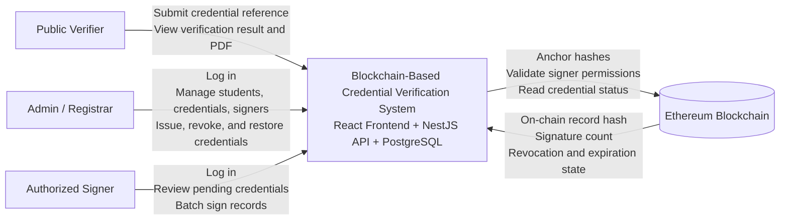

# Architecture Diagrams

This document provides a system context diagram and a Level 1 data flow diagram for the Blockchain-Based Credential Verification System.

## Context Diagram



## Data Flow Diagram

```mermaid
flowchart LR
    classDef actor fill:#dae8fc,stroke:#4c78a8,color:#111,font-weight:bold;
    classDef process fill:#d5e8d4,stroke:#5b8a5a,color:#111;
    classDef store fill:#fff2cc,stroke:#b38f00,color:#111;
    classDef chain fill:#e8d9f0,stroke:#7a4aa3,color:#111;

    public[Public Verifier]
    admin[Admin / Registrar]
    signer[Authorized Signer]

    subgraph platform[Credential Verification Platform]
        auth[1.0 Authenticate Users]
        manage[2.0 Manage Master Data\nStudents, subjects, academic records, credential types]
        issue[3.0 Issue Credential]
        sign[4.0 Batch Sign Credential]
        verify[5.0 Verify Credential]
        revoke[6.0 Revoke / Restore Credential]
        pdf[7.0 Generate Verification PDF]
    end

    users[(D1 User Store)]
    academics[(D2 Academic Records Store)]
    credentials[(D3 Credential Store)]
    signatures[(D4 Signature Log Store)]
    contract[(D5 CredentialVerifier Smart Contract)]

    admin -->|Credentials| auth
    signer -->|Credentials| auth
    auth -->|JWT cookies / session context| admin
    auth -->|JWT cookies / session context| signer
    auth <--> |User profile, role, wallet metadata| users

    admin -->|Create and maintain academic data| manage
    manage <--> |Students, subjects, grades, credential types| academics

    admin -->|Issue credential request\nstudentId, credentialTypeId, cutoff| issue
    issue -->|Read student record set\nand credential type| academics
    issue -->|Persist record metadata\ncredentialRef, hash, txHash, expiration| credentials
    issue -->|addRecord(ref, dataHash, expiration, typeId)| contract

    signer -->|Selected record IDs| sign
    sign -->|Load signer wallet metadata| users
    sign -->|Load eligible records and signer rules| credentials
    sign -->|Save PENDING and CONFIRMED signatures| signatures
    sign -->|batchSignRecords(recordRefs)| contract
    sign -->|Increment currentSignatures| credentials

    public -->|credentialRef| verify
    verify -->|Fetch record and credential type| credentials
    verify -->|Fetch linked student data for normalization| academics
    verify -->|getRecord(recordRef)| contract
    verify -->|Verification status\nvalid, tampered, revoked, expired, pending| public

    verify -->|Verified record payload| pdf
    pdf -->|Verification PDF preview / download| public

    admin -->|Revoke or restore by credentialRef| revoke
    revoke -->|Update revoked flag| credentials
    revoke -->|revokeRecord / restoreRecord| contract

    class public,admin,signer actor;
    class auth,manage,issue,sign,verify,revoke,pdf process;
    class users,academics,credentials,signatures store;
    class contract chain;
```

## Notes

- The context diagram treats PostgreSQL as part of the platform boundary and the Ethereum network as an external dependency.
- The data flow diagram reflects the implemented backend flows in `record`, `signer`, `verification`, `admin`, and `pdf` modules.
- The existing editable draw.io artifact remains available at `system-dataflow.drawio` for a more granular process view.